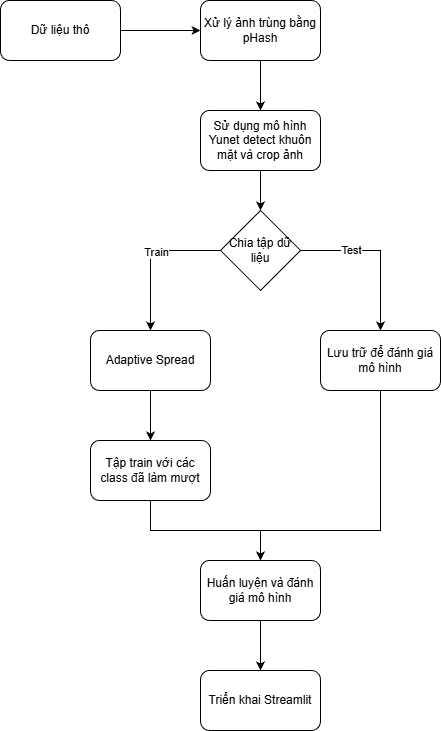
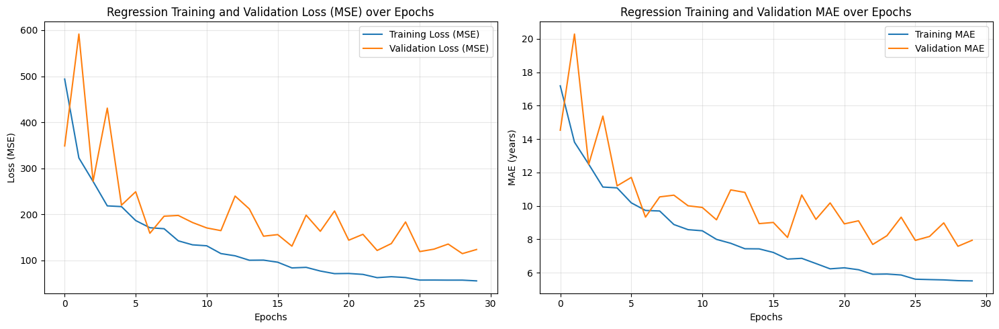
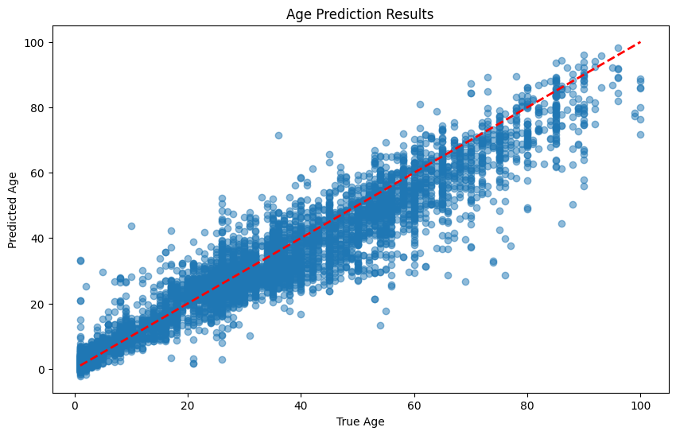

# Age Prediction from Facial Images


## 📖 Giới thiệu (Introduction)

Dự đoán tuổi từ ảnh khuôn mặt (Age Prediction) là một bài toán hồi quy (Regression) quan trọng trong lĩnh vực Thị giác máy tính (Computer Vision), có tính ứng dụng cao trong các hệ thống xác thực sinh trắc học, phân tích khách hàng và tương tác người-máy.

Dự án này xây dựng một quy trình (pipeline) hoàn chỉnh từ khâu thu thập dữ liệu thô, xử lý nhiễu, huấn luyện mô hình học sâu (Deep Learning) đến triển khai ứng dụng thực tế. Mục tiêu là tạo ra một mô hình có khả năng dự đoán độ tuổi với sai số thấp nhất có thể trong điều kiện tài nguyên tính toán giới hạn.

## 🛠 Phương pháp tiếp cận (Methodology)

Quy trình xử lý của dự án được mô tả tóm tắt qua sơ đồ dưới đây:



### 1. Tiền xử lý dữ liệu (Data Preprocessing)
Dữ liệu thô sau khi được thu thập sẽ đi qua các bước làm sạch nghiêm ngặt:
* **Loại bỏ trùng lặp:** Sử dụng kỹ thuật hashing để loại bỏ các ảnh giống nhau.
* **Face Detection (YuNet):** Sử dụng **YuNet** - một mô hình mạng nơ-ron siêu nhẹ (ultra-lightweight) và tốc độ cao để phát hiện khuôn mặt. YuNet giúp định vị chính xác vùng khuôn mặt (Region of Interest), loại bỏ background nhiễu trước khi đưa vào tập huấn luyện.

### 2. Kiến trúc mô hình (Model Architecture)
Mô hình dự đoán tuổi được xây dựng dựa trên kỹ thuật **Transfer Learning**:
* **Backbone:** Lấy cảm hứng từ kiến trúc **MobileNet** để tối ưu hóa tốc độ suy luận (inference speed) và giảm thiểu số lượng tham số.
* **Custom Head:** Tùy chỉnh thêm **2 lớp SeparableConv2D** (Separable Convolution) ở các tầng cuối. Việc này giúp mô hình học các đặc trưng mức cao (high-level features) hiệu quả hơn cho bài toán hồi quy mà vẫn giữ được tính chất nhẹ (lightweight) của mạng.

## 📊 Kết quả thực nghiệm (Results)

Mô hình đã được huấn luyện và đánh giá trên tập kiểm thử (Test set) với các chỉ số hiệu năng như sau:

| Metric | Giá trị | Ý nghĩa |
| :--- | :--- | :--- |
| **Mean Absolute Error (MAE)** | **7.57 năm** | Sai số tuyệt đối trung bình giữa tuổi dự đoán và thực tế. |
| **R2 Score** | **83.27%** | Mức độ mô hình giải thích được sự biến thiên của dữ liệu. |

## 📂 Cấu trúc dự án (Project Structure)

```bash
CK_Face_age_predict/
├── data/
│   ├──getty_images_raw
│   └──getty_images_cropped
├── images/                 
├── notebooks/             
│   ├── crawl_notebook.ipynb 
│   ├── preprocess.ipynb     
│   └── notebook.ipynb              
├── best_model_age.h5
├── streamlit_app.py         
├── requirements.txt         
└── README.md
```
**Mô tả chi tiết:**
* `notebooks/`: Thư mục chứa các Jupyter Notebook tương ứng với 3 giai đoạn nghiên cứu: thu thập, tiền xử lý và huấn luyện.
* `best_model_age.h5`: File trọng số (weights) của mô hình đã đạt hiệu suất tốt nhất (MAE 7.57), được lưu lại để phục vụ cho quá trình triển khai.
* `streamlit_app.py`: Mã nguồn chính của ứng dụng web, xử lý logic tải mô hình và giao diện người dùng.
* `requirements.txt`: Danh sách các thư viện Python cần thiết để chạy dự án.

## 🚀 Cài đặt và Sử dụng (Installation & Usage)

Để chạy dự án này trên máy cục bộ (Local Machine), vui lòng thực hiện theo các bước sau:

### 1. Clone dự án
Tải mã nguồn về máy tính của bạn:
```bash
git clone https://github.com/binhtran23/CK_Face_age_predict.git
cd CK_Face_age_predict
```
### 2. Cài Đặt Dependencies
Cài đặt từ file requirements:
```bash
pip install -r requirements.txt
```
### 3. Khởi chạy ứng dụng
Sử dụng Streamlit để chạy demo dự đoán tuổi:
```bash
streamlit run streamlit_app.py
```

## 🏗️ Kiến Trúc Mô Hình

### CNN Architecture
```
Input: (224, 224, 3)
    ↓
Conv2D(64, 3x3) + BatchNorm + MaxPool(2x2)
    ↓
Conv2D(128, 3x3) + BatchNorm + MaxPool(2x2)
    ↓
Conv2D(256, 3x3) + BatchNorm + MaxPool(2x2)
    ↓
GlobalAveragePooling2D
    ↓
Dense(256) + Dropout(0.4)
    ↓
Dense(128) + Dropout(0.4)
    ↓
Dense(1) [Age Output]
```

## 📊 Kết Quả Huấn Luyện

### 1. Training Progress


*Biểu đồ cho thấy quá trình training và validation MAE qua các epochs. Model có dấu hiệu hội tụ tốt với validation MAE giảm dần và ổn định khoảng 8-10 năm. EarlyStopping được kích hoạt khi model không cải thiện trong 10 epochs liên tiếp.*

### 2. Model Performance


*Scatter plot cho thấy mối quan hệ giữa tuổi thực tế (True Age) và tuổi dự đoán (Predicted Age). Các điểm gần đường chéo màu đỏ cho thấy dự đoán chính xác. Model hoạt động tốt ở độ tuổi 20-80, có một số khó khăn ở tuổi rất trẻ (<10) và cao tuổi (>90).*

### Metrics Cuối Cùng (Final Metrics):
- **Final MAE:** 7.57 năm (Sai số tuyệt đối trung bình - Mean Absolute Error)
- **R2 Score:** 83.27% (Hệ số xác định - Coefficient of Determination)
- **Training Time:** ~15 phút (30 epochs với EarlyStopping, GPU)
