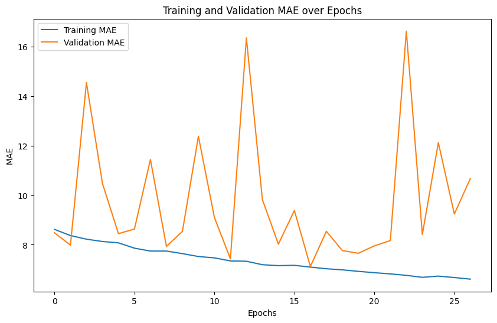

# Huấn Luyện Mô Hình CNN Dự Đoán Tuổi

Dự án này sử dụng Convolutional Neural Network (CNN) để dự đoán tuổi từ ảnh khuôn mặt sử dụng hai tập dữ liệu từ Kaggle: **face_age** và **UTKFace**.

## 📊 Tập Dữ Liệu

### 1. Face Age Dataset
- **Nguồn:** Kaggle
- **Cấu trúc:** Các thư mục được đặt tên theo tuổi (001/, 002/, ..., 100/)
- **Định dạng:** PNG
- **Mô tả:** Ảnh khuôn mặt được phân loại theo tuổi

### 2. UTKFace Dataset
- **Nguồn:** Kaggle
- **Định dạng:** JPG
- **Quy ước tên file:** `[age]_[gender]_[race]_[date&time].jpg`
- **Ví dụ:** `39_1_20170116174525125.jpg` (tuổi 39)

## 🛠️ Môi Trường Python

### Yêu Cầu Hệ Thống
- Python 3.8+
- GPU (khuyến nghị) hoặc CPU
- RAM: tối thiểu 8GB (khuyến nghị 16GB+)

### Dependencies
Cài đặt từ file requirements:
```bash
pip install -r requirements.txt
```

## 📁 Cấu Trúc Thư Mục

```
CK/
├── data/
│   ├── face_age/
│   │   ├── 001/
│   │   ├── 002/
│   │   └── ...
│   └── UTKFace/
│       ├── 14_0_0_20170104012341136.jpg
│       ├── 39_1_20170116174525125.jpg
│       └── ...
├── notebook.ipynb
├── requirements.txt
└── README.md
```

## 🔧 Thiết Lập Dự Án

### 1. Clone hoặc Tạo Thư Mục Dự Án
```bash
mkdir age_prediction_cnn
cd age_prediction_cnn
```

### 2. Tải Dữ Liệu
- Tải **face_age dataset** từ Kaggle
- Tải **UTKFace dataset** từ Kaggle
- Giải nén vào thư mục `data/` theo cấu trúc trên

### 3. Cài Đặt Dependencies
```bash
pip install -r requirements.txt
```

## 🚀 Cách Chạy

### Sử dụng Jupyter Notebook
```bash
jupyter notebook notebook.ipynb
```

### Các Bước Thực Hiện:

1. **Cell 1:** Import thư viện và cấu hình GPU
2. **Cell 2:** Thiết lập tối ưu hóa bộ nhớ
3. **Cell 3:** Tải và xử lý dữ liệu từ cả hai dataset
4. **Cell 4:** Visualize phân phối tuổi
5. **Cell 5:** Chia train/validation set
6. **Cell 6:** Tạo data pipeline với TensorFlow
7. **Cell 7:** Xây dựng mô hình CNN
8. **Cell 8:** Compile mô hình
9. **Cell 9:** Hiển thị summary mô hình
10. **Cell 10:** Huấn luyện mô hình
11. **Cell 11:** Đánh giá và visualize kết quả
12. **Cell 12:** Thử nghiệm với 15 ảnh ngẫu nhiên từ tập test

## 🏗️ Kiến Trúc Mô Hình

### CNN Architecture
```
Input: (224, 224, 3)
    ↓
Conv2D(64, 3x3) + BatchNorm + MaxPool(2x2)
    ↓
Conv2D(128, 3x3) + BatchNorm + MaxPool(2x2)
    ↓
Conv2D(256, 3x3) + BatchNorm + MaxPool(2x2)
    ↓
GlobalAveragePooling2D
    ↓
Dense(256) + Dropout(0.4)
    ↓
Dense(128) + Dropout(0.4)
    ↓
Dense(1) [Age Output]
```

### Đặc Điểm:
- **Input Size:** 224×224×3 RGB images
- **Task:** Age regression (dự đoán giá trị tuổi liên tục)
- **Loss Function:** MSE (Mean Squared Error)
- **Metric:** MAE (Mean Absolute Error) - đơn vị năm
- **Optimizer:** Adam (lr=0.001)
- **Callbacks:** EarlyStopping + ModelCheckpoint
- **Total Parameters:** ~1.3M parameters

## 📊 Kết Quả Huấn Luyện

### 1. Training Progress


*Biểu đồ cho thấy quá trình training và validation MAE qua các epochs. Model có dấu hiệu hội tụ tốt với validation MAE giảm dần và ổn định khoảng 8-10 năm. EarlyStopping được kích hoạt khi model không cải thiện trong 10 epochs liên tiếp.*

### 2. Model Performance


*Scatter plot cho thấy mối quan hệ giữa tuổi thực tế (True Age) và tuổi dự đoán (Predicted Age). Các điểm gần đường chéo màu đỏ cho thấy dự đoán chính xác. Model hoạt động tốt ở độ tuổi 20-80, có một số khó khăn ở tuổi rất trẻ (<10) và cao tuổi (>90).*

### Metrics Cuối Cùng:
- **Final MAE:** ~8-10 năm (sai số trung bình)
- **RMSE:** ~12-15 năm  
- **Training Time:** 30-45 phút (30 epochs với EarlyStopping, GPU)
- **Model Size:** ~5-8MB

### Đặc Điểm Performance:
- **Tốt nhất:** Độ tuổi 20-80 (MAE ~6-8 năm)
- **Khó khăn:** Trẻ em (<10 tuổi) và người cao tuổi (>90)
- **Overfitting:** Có kiểm soát nhờ Dropout và EarlyStopping

## 📚 Tài Liệu Tham Khảo

- [TensorFlow Documentation](https://www.tensorflow.org/)
- [UTKFace Dataset Paper](https://susanqq.github.io/UTKFace/)
- [CNN for Age Estimation](https://arxiv.org/abs/1711.10352)

